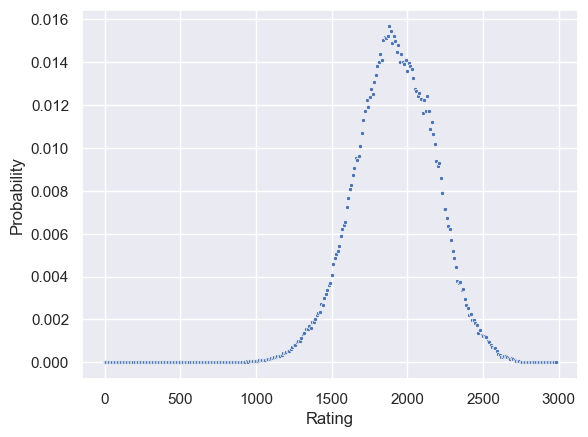
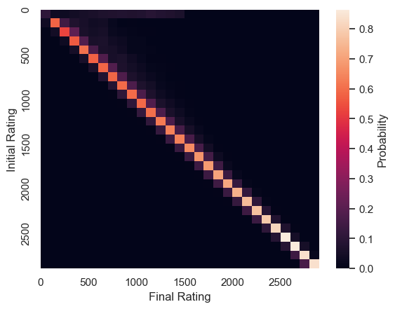
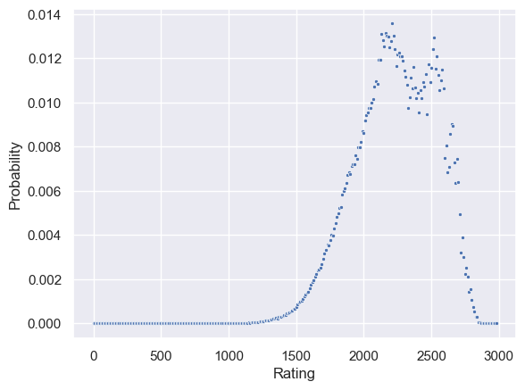
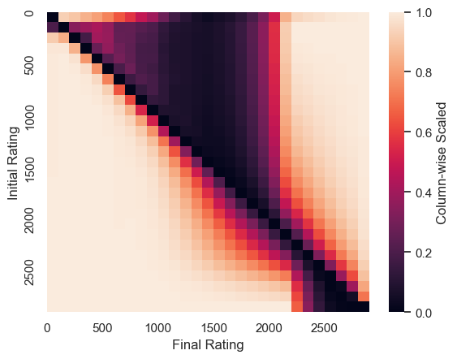
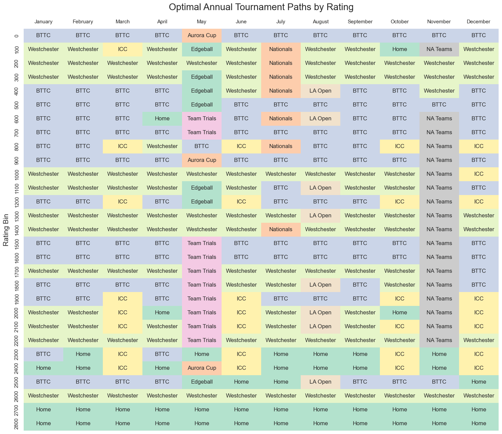

# USATT Rating Dynamics

An empirical Markov-chain study of how USA Table Tennis (USATT) ratings move through the competitive player population.

## Motivation

A rating is usually read as a snapshot of player strength. I wanted to study the other side of the problem: how the rating system itself changes the distribution of ratings as players repeatedly compete.

The central questions are:

- Which rating states are most common after repeated tournament play?
- How local are rating changes from one tournament to the next?
- How many tournaments does it typically take to reach a target rating?
- Are some rating levels much easier to reach or revisit than others?

These questions are useful for understanding rating stability, player development, and the difference between a rating leaderboard and a dynamic system. The project combines historical USATT data, a reimplementation of the USATT rating rules, and stochastic state-transition analysis.

## Project Summary

The repository contains four connected pieces:

1. A Python implementation of the USATT rating exchange and adjustment rules.
2. Data loaders and preprocessing for player histories, player statistics, and tournament results.
3. A Markov-chain model that estimates rating-bin transitions from historical tournament records.
4. Simulation and visualization code for stationary behavior, passage times, and rating paths.

The primary analysis is in [`markov_chain/bins.ipynb`](markov_chain/bins.ipynb), with earlier aggregation work in [`markov_chain/aggregate.ipynb`](markov_chain/aggregate.ipynb). The generated figures are collected in [`markov_chain/results/`](markov_chain/results/).

## Data and Rating Engine

The source data in [`data/`](data/) includes player lists, player statistics, player histories, tournament ratings, and historical rating changes. [`data/load.py`](data/load.py) standardizes numeric and date fields so the analysis notebooks can work with consistent tables.

[`elo_system/calculator.py`](elo_system/calculator.py) implements the USATT update process. For each tournament, it:

1. applies exceptional-result adjustments,
2. assigns initial ratings to unrated players, and
3. applies the ordinary rating exchange chart to wins and losses.

This makes the project more than a purely abstract Markov model: the transition behavior is tied to the rating rules that generate the observed rating changes.

## Method

### Empirical transition matrix

The analysis takes each historical tournament transition from `Initial Rating` to `Final Rating` and bins both values into 100-point rating intervals from 0 through 3,000. For each starting bin $i$ and ending bin $j$, the transition probability is estimated as:

$$
P_{ij} = \frac{\text{historical transitions from } i \text{ to } j}{\text{all historical transitions starting in } i}
$$

Each row of the resulting matrix represents one tournament step. The state-space approach reduces noisy player-level histories to a tractable model of population movement while preserving the observed direction and size of rating changes.

### Repeated transitions

If $\pi_0$ is an initial distribution over rating bins and $P$ is the one-tournament transition matrix, the distribution after $t$ tournaments is:

$$
\pi_t = \pi_0 P^t
$$

The notebooks use this operation to examine how a starting state spreads through the rating system after repeated tournaments. They also solve for a stationary distribution $\pi$ satisfying $\pi P = \pi$, using both linear algebra and iterative methods as checks on one another.

### Passage and recurrence times

For each pair of rating bins, the mean first-passage time measures the expected number of tournaments needed to reach a destination for the first time. The analysis also uses the stationary distribution to calculate recurrence behavior: states with lower stationary probability are expected to take longer to revisit.

### Supplemental Monte Carlo model

The scripts in [`elo_system/simulations/`](elo_system/simulations/) provide a second, more detailed experiment. Match outcomes are sampled from a logistic model:

$$
P(\text{player wins}) = \frac{1}{1 + 10^{(r_o-r_p)/121.37092754}}
$$

where $r_p$ is the player's rating and $r_o$ is the opponent's rating. Simulated players face empirical opponent-rating distributions from major tournaments, play 10 matches per tournament, and follow a recurring annual schedule. The main long-run outputs contain 18,000 simulated players, 50 years, and 601 monthly observations per player.

## Results

The figures below are the five visualizations generated by the Markov-chain analysis. Together, they move from the empirical input distribution to one-step dynamics, long-run behavior, reachability, and paths through the rating system.

### 1. Tournament rating distribution

The first figure shows the empirical rating distribution used to describe tournament participation. It motivates the state-space choice: tournament opponents are not uniformly distributed across all possible ratings, so the transition process is shaped by where players actually compete.



### 2. One-step transition matrix

Each cell estimates the probability of moving from an initial rating bin to a final rating bin in one tournament. The concentration near the diagonal indicates that most rating changes are local, while off-diagonal structure captures larger gains and losses.



### 3. Stationary rating distribution

The stationary distribution is the long-run state distribution implied by the empirical transition matrix. It answers the question: if the same transition behavior continued for many tournaments, where would probability mass accumulate?



### 4. Mean first-passage times

The mean first-passage-time visualization shows the expected number of tournaments required to reach a rating state, using 2,000 as the target in the notebook's plotted example. The companion heatmap encodes passage times across starting and ending rating bins, making difficult-to-reach regions visible even when a single target curve hides them.



### 5. Optimal rating paths

The optimal-path visualization summarizes the most favorable or likely routes through the rating-state space. It helps interpret the transition matrix as a navigable system rather than only as a collection of probabilities: a player can move through intermediate rating bins, and the route depends on the local transition structure.



### Supplemental simulation findings

The committed Monte Carlo outputs provide a useful comparison with the binned Markov model:

- A population initialized at a single rating of 1,000 finishes with a mean of 998.9 and a standard deviation of 228.7 after 50 years.
- A population initialized at a single rating of 1,500 finishes with a mean of 1,505.9 and a standard deviation of 336.9.
- A population initialized at a single rating of 2,250 finishes with a mean of 2,328.3 and a standard deviation of 300.6.
- The run initialized from the observed player distribution moves from a mean of 1,388.6 to 1,397.9, while its standard deviation grows from 547.4 to 633.4.
- The extreme starting distribution moves from a mean of 1,602.8 to 1,608.2, with standard deviation decreasing from 1,400.0 to 1,378.7.

The common pattern is a relatively stable central tendency alongside substantial dispersion and dependence on the starting distribution. These are model-based results, not claims that future USATT ratings will follow the same exact paths.

## Repository Guide

| Path                                                                                     | Purpose                                                         |
| ---------------------------------------------------------------------------------------- | --------------------------------------------------------------- |
| [`data/`](data/)                                                                         | Source data and loading functions                               |
| [`elo_system/calculator.py`](elo_system/calculator.py)                                   | USATT rating calculation implementation                         |
| [`elo_system/simulations/`](elo_system/simulations/)                                     | Monte Carlo scripts and generated histories                     |
| [`elo_system/major_tournament_history_data/`](elo_system/major_tournament_history_data/) | Tournament-specific historical distributions                    |
| [`markov_chain/bins.ipynb`](markov_chain/bins.ipynb)                                     | Binned transition, stationary, passage-time, and path analysis  |
| [`markov_chain/aggregate.ipynb`](markov_chain/aggregate.ipynb)                           | Earlier transition aggregation analysis                         |
| [`markov_chain/results/`](markov_chain/results/)                                         | Generated Markov-chain visualizations                           |
| [`mdp/`](mdp/)                                                                           | Major-tournament preprocessing and decision-process exploration |

## Reproducing the Analysis

Create and activate a virtual environment, then install the analysis dependencies:

```bash
python -m venv .venv
source .venv/bin/activate
pip install numpy pandas scipy matplotlib seaborn alive-progress jupyter
```

On Windows PowerShell, activate the environment with:

```powershell
.\.venv\Scripts\Activate.ps1
```

Open the notebooks from the repository root:

```bash
jupyter notebook markov_chain/bins.ipynb
```

The preprocessing script for major-tournament files is:

```bash
python mdp/majors_data_agg.py
```

The supplemental long-run simulation is:

```bash
python elo_system/simulations/majors_simulation.py
```

Generated simulation histories are written to [`elo_system/simulations/outputs/`](elo_system/simulations/outputs/). Parameters near the top of the simulation script control iterations, years, matches per tournament, and the initial rating distribution.

## Limitations and Next Steps

- The Markov model treats the rating-bin transition probabilities as stationary, even though player skill, participation, and tournament composition can change over time.
- Binning at 100 rating points improves tractability but removes within-bin information.
- Historical transitions may reflect selection effects: active players and tournament participants are not a random sample of all rated players.
- The logistic match model uses a fixed scale rather than being re-estimated and evaluated on held-out matches.
- The current figures are descriptive and exploratory; they are not a formal forecast or causal estimate of player development.
- A next iteration would validate predictions on held-out tournaments, estimate time-varying transition matrices, and compare USATT with alternative rating systems.

## Tools

Python, pandas, NumPy, SciPy, Matplotlib, Seaborn, Jupyter, and sparse linear algebra.
